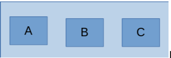
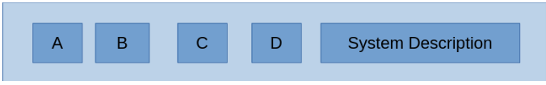
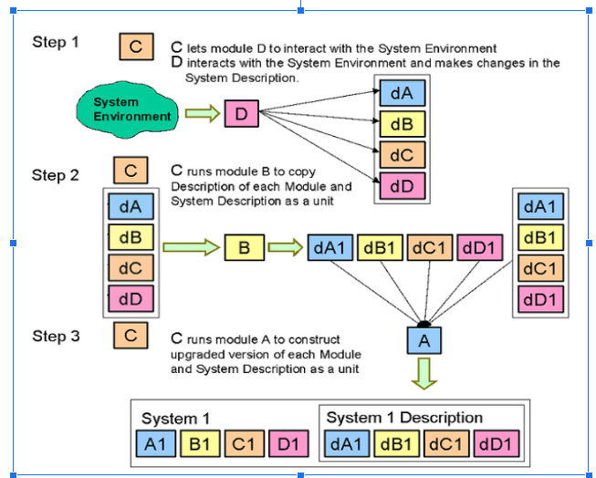
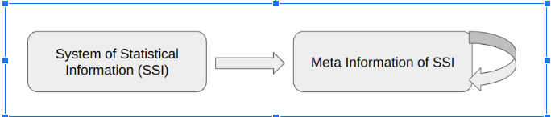
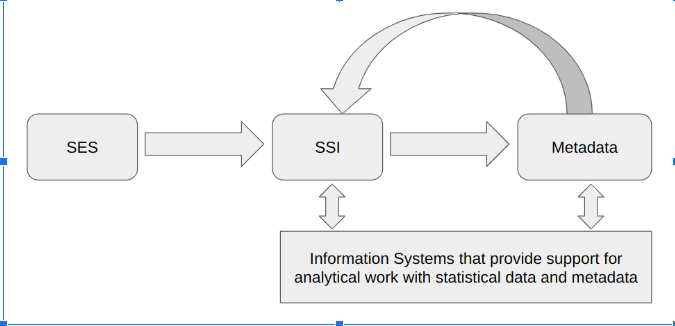
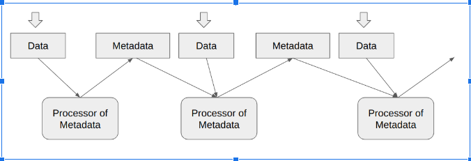
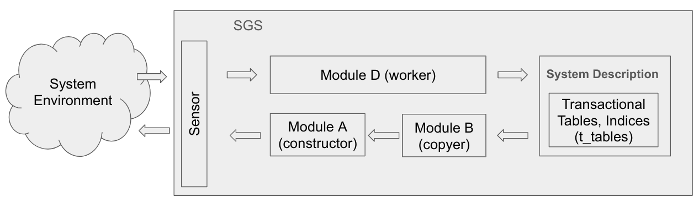
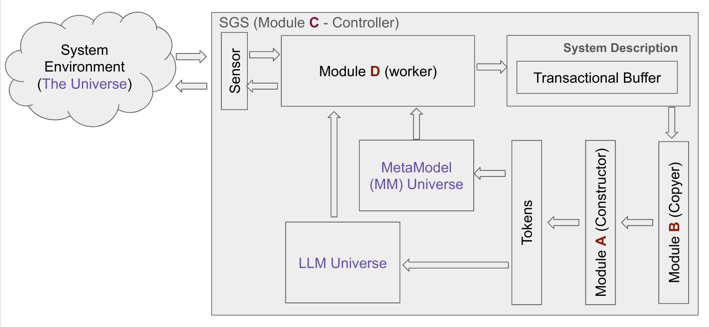
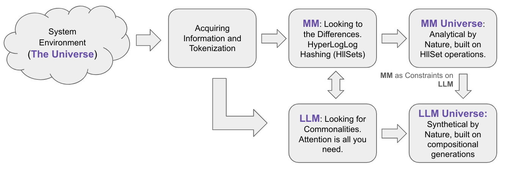

# sgs_icaisns
Demo project for the 2nd International Conference on Artificial Intelligence, Systems and Cyber Security (AISNS 2024)

## Introduction to SGS

    道德经
    42
    道生一，一生二，二生三，三生万物。

    Dao De Jing
    Chapter 42
    Tao produces unity; unity produces duality; duality produces trinity; trinity produces all things.

- **John von Neumann's Theory**: Focuses on self-reproducing automata with three core modules: A (Universal Constructor), B (Universal Copier), and C (Universal Controller).

- **Enhanced Model**: Introduces a fourth module, D, for environmental interaction, creating a more dynamic self-replicating system.

Self Reproduction flow-chart for extended Self Reproducing System with System description:

## Key Concepts
- **Self-Replication**: The process involves creating an identical system capable of initiating its replication cycle.
- **System Upgrade Automation**: Incorporates self-upgrading capabilities and interaction with the environment.

In summary, Self-Generative Systems (SGS) integrate the principles of John von Neumann's Self-Reproducing Automata into artificial intelligence models. This research and development initiative distinguishes itself from traditional methodologies in several key ways:

1. **Adaptation of the HyperLogLog Algorithm**: We utilize the HyperLogLog method to approximate datasets within fixed-size structures, which mimic the properties and operations of conventional sets, such as union, intersection, and complement. These structures are known as HllSets.

2. **Emphasis on Metadata Over Raw Data**: By employing HllSets, we represent metadata and link it to the corresponding data approximated as HllSets. This approach transitions the focus from direct data manipulation to a strategy centered on metadata.

3. **Implementation of a Self-Generative Loop**: Drawing inspiration from John von Neumann's theory, we have developed a self-generative loop within the AI model. This innovative framework is a core component of our project, Self-Generative Systems (SGS). Further details can be found in Chapter 3: Life Cycle, Transactions, and Commits.

## Metadata Management
- **Metadata Definition**: Information about information, crucial for managing data systems.
- **Cyclical Nature**: Metadata generation is dynamic and iterative, evolving over time.

**Mapping Statistical Information to Meta Information**

**Feed back loop of the SSI into Matadata**

By integrating **socio-economic systems (SES)** mapping into **statistical information systems (SIS)** through statistical observation, and then mapping SIS into Metadata, we can develop a comprehensive and generalized scheme.

## HllSets
- **Based on HyperLogLog Algorithm**: Supports set theory properties, aiding efficient data analysis.
- **Properties**: Includes commutative, associative, distributive, and idempotent laws.

HllSets is a data structure based on the HyperLogLog algorithm developed by
Philippe Flajolet, Éric Fusy, Olivier Gandouet, and Frédéric Meunier [6]. We
significantly refined this approach by developing a data structure that, while
maintaining the compactness of the original HyperLogLog structure, supports all
the standard properties of Set Theory. In the post [3], we demonstrated that HllSets
adhere to all the fundamental properties of Set theory.
The fundamental properties that HllSets complies with are as follows:

Commutative Property:
1. (A ∪ B) = (B ∪ A)
2. (A ∩ B) = (B ∩ A)

Associative Property:

3. (A ∪ B) ∪ C) = (A ∪ (B ∪ C))
4. (A ∩ B) ∩ C) = (A ∩ (B ∩ C))

Distributive Property:

5. ((A ∪ B) ∩ C) = (A ∩ C) ∪ (B ∩ C)
6. ((A ∩ B) ∪ C) = (A ∪ C) ∩ (B ∪ C)

Identity:

7. (A ∪ ∅) = A
8. (A ∩ U) = A

In addition to these fundamental properties, HllSets also satisfy the following
additional laws:

Idempotent Laws:

9. (A ∪ A) = A
10. (A ∩ U) = A

To see the source code that proves HllSets satisfies all of these requirements, refer to **hll_sets.ipynb**.

## Lifecycle Management
- **Transactions**: Use of a "transaction" index for data management, ensuring clear separation and control over data processing.
- **Commits**: Tracks modifications, categorizing entity instances as Head, Tail, or Deleted.

**Transactional Interaction between SGS and Environment**

**Commiting changes in SGS** is a methodical process that entails several steps:
- Creating a new version of the item to be updated;
- Applying the required modifications to this new version;
- Saving these changes;
- Establishing a connection between the new and the former version of the item.

The commit history functions as the intrinsic timeline of Self-Generative Systems, akin to biological time in living organisms.

## Static and Dynamic Metadata Structures
- **Static Structure**: Fixed relationships, easily replicated.
- **Dynamic Structure**: Evolving relationships, adapting to real-world changes.

## Integration with AI Models
- **SGS and LLMs**: Seamless integration enhances system functionality, combining analytical and synthetical approaches.
- **Metadata Models (MM)**: Provides constraints to guide LLM outputs, ensuring relevance and coherence.

**Flow-chart of transforming Environment Observations into data and then into LLM and MM**

**MM**: Looking at the Differences. HyperLogLog Hashing (HllSets). MM Universe:
Analytical by Nature, built on HllSet operations.
The MM universe is fundamentally analytical in nature, relying on a structured
approach to understanding and manipulating data. Metadata models serve as
explicit constraints that guide the generation process. Through HllSet operations,

**LLM**: Looking for Commonalities. Attention is all you need. LLM Universe:
Synthetical by Nature, built on compositional generations.
The LLM universe is synthetical by nature, focusing on the identification of
commonalities rather than differences. Grounded in the principles of attention
mechanisms, LLMs leverage vast amounts of textual data to generate human-like
text through compositional generation. This approach enables LLMs to synthesize
information from diverse sources, creating coherent narratives or responses based
on patterns learned during training.

While **MM** emphasizes analytical differentiation, **LLM** seeks to establish connections and similarities across datasets. This synthesis is driven by the model’s ability to attend to various parts of the input data, allowing it to weave together disparate pieces of information into a unified output. However, this compositional generation process is not without its challenges; it requires careful calibration to ensure that the generated content remains relevant and meaningful.

### The Role of Metadata Models as Constraints

The integration of metadata models into the generative processes of LLMs can
enhance their effectiveness by providing a structured framework that guides the
synthesis of information. By imposing explicit constraints, metadata models can
help mitigate issues related to coherence and relevance, ensuring that the outputs
generated by LLMs adhere to the desired characteristics of the intended application.

For instance, in a self-generative system that seeks to create personalized
recommendations, metadata models can define parameters such as user preferences
and contextual information. These constraints can guide the LLM in synthesizing
outputs that are not only relevant but also tailored to the specific needs of the user.

**In summary**, the interplay between self-generative systems, metadata models, and large language models highlights the importance of both analytical and synthetical approaches in the generation of meaningful outputs. While MM emphasizes the need for explicit constraints through HllSet operations, LLM focuses on the synthesis of commonalities through attention mechanisms. By integrating these paradigms, we can create robust self-generative systems capable of producing high-quality, contextually relevant content.

### Benefits of Integration
1. **Efficiency**: Automates data synchronization, reducing manual effort.
2. **Accuracy**: Keeps AI models updated with real-world changes.
3. **Scalability**: Manages increased data loads effectively.
4. **Flexibility**: Supports diverse AI models and data types.
5. **Cost-Effectiveness**: Streamlines data management, reducing operational costs.

## Conclusion
- **Transformative Potential**: SGS and AI integration offers robust, contextually relevant content generation.
- **Synergy**: The collaboration between MM and LLM approaches enhances data analytics environments.

# References

1. NEUMANN, John von. Theory of Self-Reproducing Automata. Edited and Completed by Arthur W. Burks. Urbana and London: University of Illinois Press, 1966.
2. https://en.wikipedia.org/wiki/Kozma_Prutkov
3. https://www.linkedin.com/posts/alex-mylnikov-5b037620_hllset-relational-
algebra-activity-7199801896079945728-4_bI?
utm_source=share&utm_medium=member_desktop
4. https://www.linkedin.com/posts/alex-mylnikov-5b037620_hyperloglog-
based-approximation-for-very-activity-7191569868381380608-CocQ?
utm_source=share&utm_medium=member_desktop
5. https://www.linkedin.com/posts/alex-mylnikov-5b037620_hllset-analytics-
activity-7191854234538061825-z_ep?
utm_source=share&utm_medium=member_desktop
6. https://algo.inria.fr/flajolet/Publications/FlFuGaMe07.pdf
7. https://static.googleusercontent.com/media/research.google.com/en//pubs/a
8. https://github.com/alexmy21/SGS/blob/sgs_ai_32/hll_sets.ipynb
9. https://www.linkedin.com/posts/alex-mylnikov-5b037620_demo-application-
enron-email-analysis-with-activity-7195832040548614145-5Ot5?utm_source=share&utm_medium=member_desktop
10. https://github.com/alexmy21/lisa_meta/blob/main/lisa_enron.ipynb
11. https://github.com/alexmy21/lisa_meta/blob/main/hll_algebra.ipynb
12. https://arxiv.org/pdf/2311.00537 (Machine Learning Without a Processor:
Emergent Learning in a Nonlinear Electronic Metamaterial)
13. https://s3.amazonaws.com/arena-
attachments/736945/19af465bc3fcf3c8d5249713cd586b28.pdf (Deep
listening)
14. https://www.deeplistening.rpi.edu/deep-listening/
15. https://en.wikipedia.org/wiki/Von_Neumann_universal_constructorhttps://en
16. https://github.com/alexmy21/SGS/blob/sgs_ai_32/simulation.ipynb 

These notes encapsulate the article's exploration of SGS, its theoretical foundations, practical applications, and the integration with AI models to create advanced, self-generative systems.