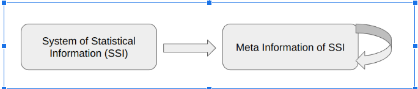
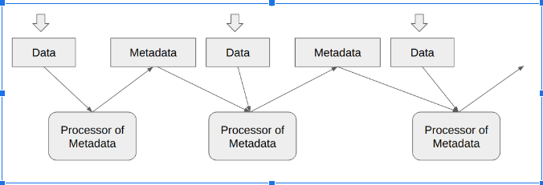

# sgs_icaisns
第二届人工智能、系统与网络安全国际会议（AISNS 2024）演示项目

## SGS简介

    道德经
    42
    道生一，
    一生二，
    二生三，
    三生万物。

    Dao De Jing
    Chapter 42
    Tao produces unity; 
    unity produces duality; 
    duality produces trinity; 
    trinity produces all things.
    (https://www.yellowbridge.com/onlinelit/daodejing42.php)

- **约翰·冯·诺依曼的理论**：重点在于自我复制自动机，由三个核心模块组成：A（通用构造器）、B（通用复制器）和C（通用控制器）。

- **增强模型**：引入第四个模块D，用于环境交互，创建一个更动态的自我复制系统。

扩展自我复制系统的自我复制流程图及系统描述：

## 关键概念
- **自我复制**：这一过程涉及创建一个能够启动其复制周期的相同系统。
- **系统升级自动化**：包含自我升级能力和与环境的交互。

总之，自生成系统（SGS）将约翰·冯·诺依曼的自我复制自动机的原则整合到人工智能模型中。该研究与开发计划在几个关键方面与传统方法有所区别：

1. **超日志算法的适应**：我们利用超日志方法在固定大小结构内近似数据集，这些结构模仿传统集合的属性和操作，例如并集、交集和补集。这些结构被称为HllSets。

2. **强调元数据而非原始数据**：通过使用HllSets，我们表示元数据并将其链接到相应的数据近似为HllSets。这种方法将重点从直接的数据操作转移到以元数据为中心的策略。

3. **自生成循环的实施**：受到约翰·冯·诺依曼理论的启发，我们在AI模型中开发了一个自生成循环。这个创新框架是我们项目——自生成系统（SGS）的核心组成部分。更多详细信息请参见第3章：生命周期、事务和提交。

## 元数据管理
- **元数据定义**：关于信息的信息，对于管理数据系统至关重要。
- **循环性质**：元数据生成是动态和迭代的，随着时间的推移而发展。

**将统计信息映射到元信息**

**将SSI的反馈循环整合到元数据中**

通过将**社会经济系统（SES）**映射整合到**统计信息系统（SIS）**中，并通过统计观察将SIS映射到元数据中，我们可以制定一个全面和通用的方案。

## HllSets
- **基于HyperLogLog算法**：支持集合论性质，有助于高效数据分析。
- **性质**：包括交换律、结合律、分配律和幂等律。

HllSets是基于由Philippe Flajolet、Éric Fusy、Olivier Gandouet和Frédéric Meunier开发的HyperLogLog算法的数据结构。我们通过开发一种数据结构显著改进了这一方法，该结构在保持原始HyperLogLog结构紧凑性的同时，支持集合论的所有标准性质。在帖子[3]中，我们展示了HllSets符合集合论的所有基本性质。
HllSets遵循的基本性质如下：

交换律：
1. (A ∪ B) = (B ∪ A)
2. (A ∩ B) = (B ∩ A)

结合律：

3. (A ∪ B) ∪ C) = (A ∪ (B ∪ C))
4. (A ∩ B) ∩ C) = (A ∩ (B ∩ C))

分配律：

5. ((A ∪ B) ∩ C) = (A ∩ C) ∪ (B ∩ C)
6. ((A ∩ B) ∪ C) = (A ∪ C) ∩ (B ∪ C)

恒等律：

7. (A ∪ ∅) = A
8. (A ∩ U) = A

除了这些基本性质外，HllSets还满足以下附加定律：

幂等律：

9. (A ∪ A) = A
10. (A ∩ U) = A

要查看证明HllSets满足所有这些要求的源代码，请参阅 **hll_sets.ipynb**。

## 生命周期管理
- **事务**：使用“事务”索引进行数据管理，确保数据处理的明确分离和控制。
- **提交**：跟踪修改，将实体实例分类为Head、Tail或Deleted。

**SGS与环境之间的事务交互**

**在SGS中提交更改**是一个系统化的过程，包含几个步骤：
- 创建要更新项目的新版本；
- 对该新版本应用所需的修改；
- 保存这些更改；
- 在新版本和旧版本之间建立连接。

提交历史作为自生成系统的内在时间线，类似于生物体中的生物时间。

## 静态和动态元数据结构
- **静态结构**：固定关系，易于复制。
- **动态结构**：不断演变的关系，适应现实世界的变化。

## 与AI模型的集成
- **SGS与大型语言模型（LLMs）**：无缝集成增强系统功能，结合分析和综合方法。
- **元数据模型（MM）**：提供约束以指导LLM输出，确保相关性和连贯性。

**将环境观察转化为数据，然后转化为LLM和MM的流程图**

**MM**：关注差异。HyperLogLog 哈希（HllSets）。MM宇宙：
本质上是分析型的，基于HllSet操作构建。
MM宇宙本质上是分析型的，依赖于一种结构化的方法来理解和操作数据。元数据模型作为明确的约束，引导生成过程。通过HllSet操作，

**LLM**：寻找共同点。注意力是你所需要的一切。LLM宇宙：
本质上是合成型的，基于组合生成构建。
LLM宇宙本质上是合成型的，关注于识别共同点而非差异。基于注意力机制的原则，LLM利用大量文本数据通过组合生成生成类人文本。这种方法使LLM能够从多种来源合成信息，基于在训练中学习到的模式创建连贯的叙述或响应。

虽然**MM**强调分析性差异，但**LLM**则寻求在数据集之间建立联系和相似性。这种合成由模型对输入数据各部分的关注能力驱动，使其能够将不同的信息片段编织成统一的输出。然而，这一组合生成过程并非没有挑战；它需要仔细的校准，以确保生成的内容保持相关性和意义。

### 元数据模型作为约束的角色

将元数据模型整合到LLM的生成过程中可以通过提供一个结构化的框架来增强其有效性，指导信息的合成。通过施加明确的约束，元数据模型可以帮助缓解与连贯性和相关性相关的问题，确保LLM生成的输出符合预期应用的特征。

例如，在一个寻求创建个性化推荐的自生成系统中，元数据模型可以定义用户偏好和上下文信息等参数。这些约束可以指导LLM合成不仅相关而且符合用户特定需求的输出。

**总结**：自生成系统、元数据模型和大型语言模型之间的相互作用突显了分析性和合成性方法在生成有意义输出中的重要性。虽然MM强调通过HllSet操作施加明确的约束，但LLM则关注通过注意力机制合成共同点。通过整合这些范式，我们可以创建强大的自生成系统，能够生成高质量、上下文相关的内容。

### 整合的好处
1. **效率**：自动化数据同步，减少人工工作。
2. **准确性**：使AI模型与现实世界变化保持同步。
3. **可扩展性**：有效管理增加的数据负载。
4. **灵活性**：支持多种AI模型和数据类型。
5. **成本效益**：简化数据管理，降低运营成本。

## 结论
- **转型潜力**：SGS和AI整合提供强大、上下文相关的内容生成。
- **协同效应**：MM和LLM方法之间的合作增强了数据分析环境。

# 参考文献

1. NEUMANN, John von. Theory of Self-Reproducing Automata. Edited and Completed by Arthur W. Burks. Urbana and London: University of Illinois Press, 1966.
2. https://en.wikipedia.org/wiki/Kozma_Prutkov
3. https://www.linkedin.com/posts/alex-mylnikov-5b037620_hllset-relational-
algebra-activity-7199801896079945728-4_bI?
utm_source=share&utm_medium=member_desktop
4. https://www.linkedin.com/posts/alex-mylnikov-5b037620_hyperloglog-
based-approximation-for-very-activity-7191569868381380608-CocQ?
utm_source=share&utm_medium=member_desktop
5. https://www.linkedin.com/posts/alex-mylnikov-5b037620_hllset-analytics-
activity-7191854234538061825-z_ep?
utm_source=share&utm_medium=member_desktop
6. https://algo.inria.fr/flajolet/Publications/FlFuGaMe07.pdf
7. https://static.googleusercontent.com/media/research.google.com/en//pubs/a
8. https://github.com/alexmy21/SGS/blob/sgs_ai_32/hll_sets.ipynb
9. https://www.linkedin.com/posts/alex-mylnikov-5b037620_demo-application-
enron-email-analysis-with-activity-7195832040548614145-5Ot5?utm_source=share&utm_medium=member_desktop
10. https://github.com/alexmy21/lisa_meta/blob/main/lisa_enron.ipynb
11. https://github.com/alexmy21/lisa_meta/blob/main/hll_algebra.ipynb
12. https://arxiv.org/pdf/2311.00537 (Machine Learning Without a Processor:
Emergent Learning in a Nonlinear Electronic Metamaterial)
13. https://s3.amazonaws.com/arena-
attachments/736945/19af465bc3fcf3c8d5249713cd586b28.pdf (Deep
listening)
14. https://www.deeplistening.rpi.edu/deep-listening/
15. https://en.wikipedia.org/wiki/Von_Neumann_universal_constructorhttps://en
16. https://github.com/alexmy21/SGS/blob/sgs_ai_32/simulation.ipynb 

这些笔记概括了文章对SGS的探索，包括其理论基础、实际应用，以及与AI模型的整合，以创建先进的自生成系统。